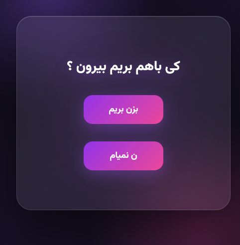
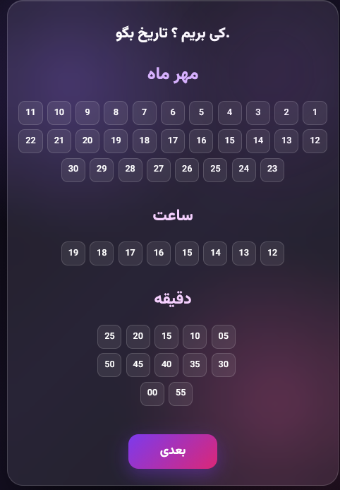
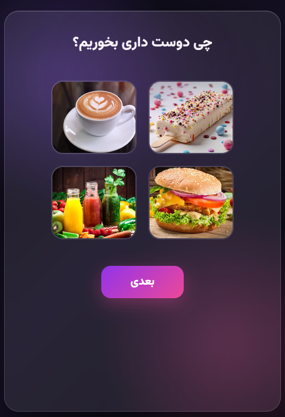
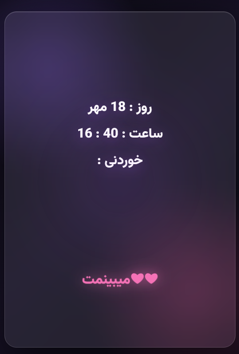

# 💜 Date Invitation

A cute and interactive date invitation website built with HTML, CSS, and JavaScript.

The project starts with a simple question and turns it into a small interactive experience where the user can choose a date, time, and favorite food. ❤️

## ✨ Features

- 💜 Interactive date invitation
- 😄 Funny "I'm not coming" button interaction
- 📅 Date selection
- 🕐 Time selection
- 🍦 Food selection
- ❤️ Final confirmation screen
- 📱 Responsive design
- 🎨 Modern glassmorphism-style UI
- 🌙 Dark purple/pink visual theme

## 🛠️ Technologies

- HTML5
- CSS3
- JavaScript
- Responsive Design

## 🎯 About the Project

This project was created as a practice project to improve my skills in:

- DOM manipulation
- JavaScript click events
- Changing styles with JavaScript
- Working with user selections
- Building interactive web interfaces
- Creating responsive layouts

## 🚀 Live Demo

🔗 [View Live Demo](https://mhmdkbyry908-art.github.io/date-invitation/)

## 📸 Screenshots

### Main Page

### Date & Time Selection

### Food Selection

### Final Result

## 👨‍💻 Author

**Mohammad Kabiri**

Front-End Developer | HTML | CSS | JavaScript

🔗 GitHub: [@mhmdkbyry908-art](https://github.com/mhmdkbyry908-art)

📧 Email: mhmdkbyry908@gmail.com
